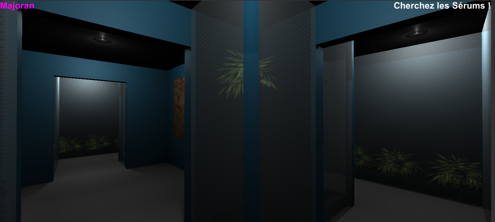
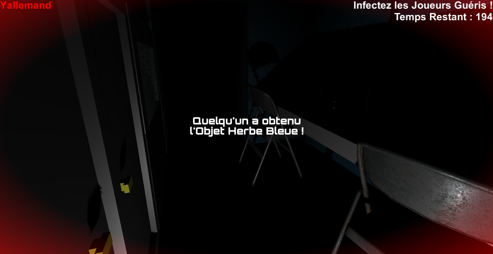
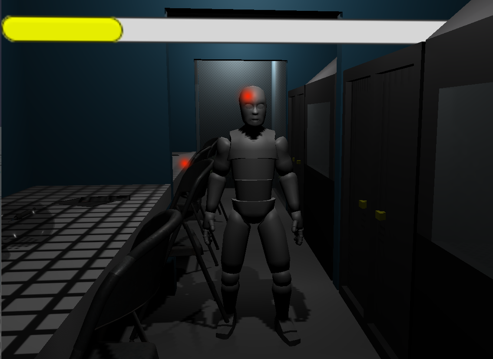
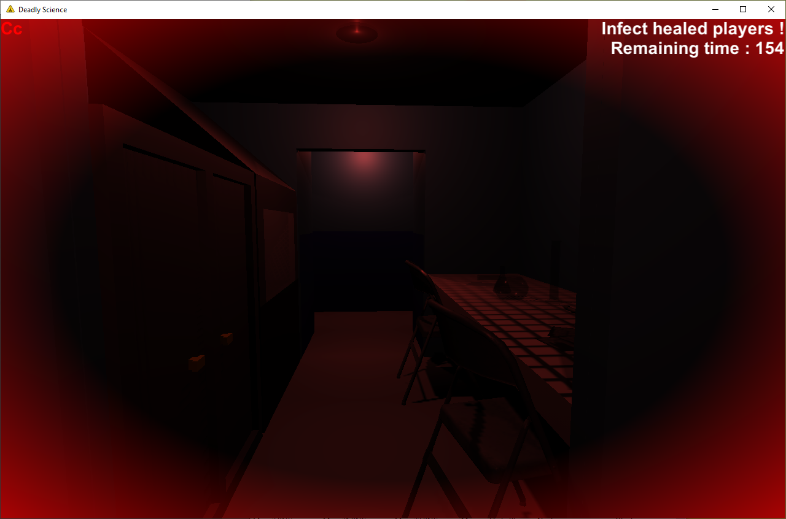
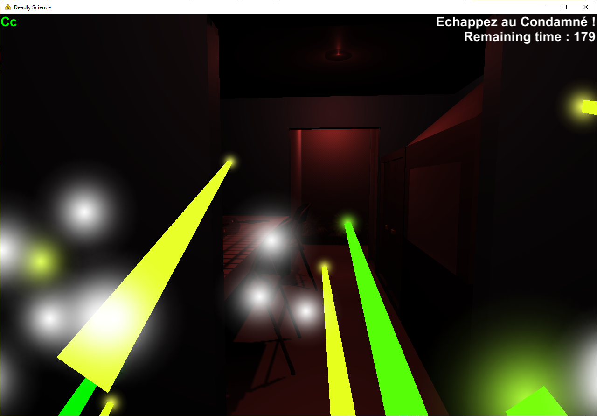
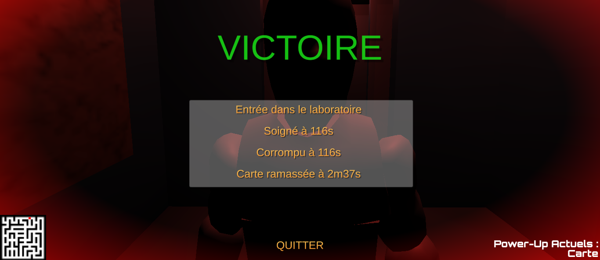

# Deadly-Science

S2 projet at EPITA by team Custos Carceris.

## The game

Deadly Science takes place in a maze, the goal is obviously to survive.

For this, you have first of all to take a serum to become a healed player.

There are always one player who remains infected, he has a last chance to win by infecting all other players by the end of a short time. So healed players will have to run for their lives...

## Images

## Project Architecture
- Deadly-science-web : Website
- doc : Documentation, documents and log
- DeadlyScience : Unity project
- res : Resources, raw format and README images
- bin : Installers
